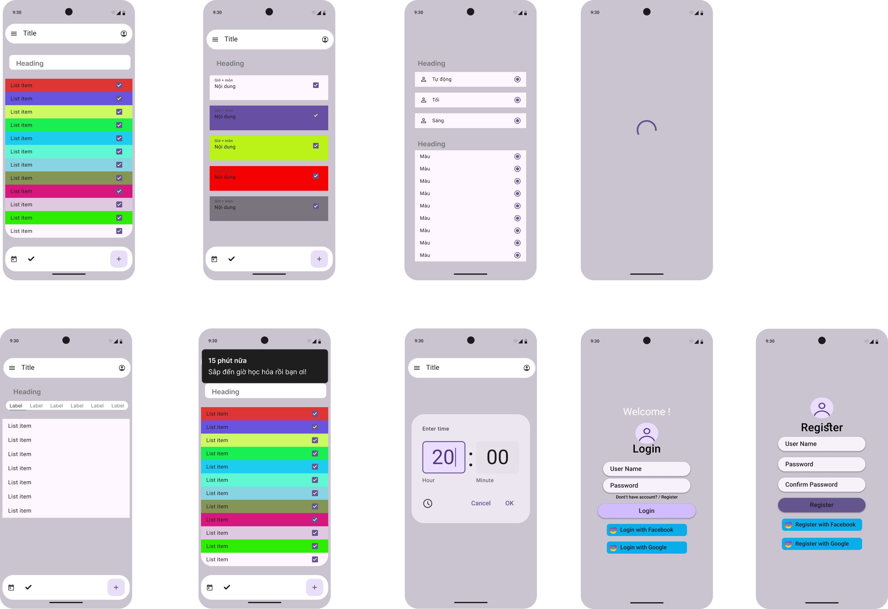

# ☕ Coffee Shop App

Ứng dụng đặt đồ uống và đồ ăn trực tuyến trên nền tảng Android, được phát triển bằng **Kotlin** và **Jetpack Compose**, tích hợp **Firebase** để xử lý dữ liệu thời gian thực và xác thực người dùng.

> 📌 Đây là đồ án môn **Lập Trình Thiết Bị Di Động** – Trường Đại học Giao thông Vận tải TP.HCM (UTH)  
> Lớp: CN22D – Nhóm 12 | GVHD: ThS. Trương Quang Tuấn

---

## 📱 Giao diện ứng dụng



---

## 🚀 Tính năng chính

| Tính năng | Mô tả |
|---|---|
| 🔐 Đăng ký / Đăng nhập | Tạo tài khoản mới, đăng nhập bằng email & mật khẩu hoặc **Google Sign-In** |
| 👤 Hồ sơ cá nhân | Xem và quản lý thông tin tài khoản, đăng xuất |
| 🏠 Trang chủ | Duyệt sản phẩm theo **9 danh mục** (Ice Drink, Hot Drink, Hot Coffee, Ice Coffee, Brewing Coffee, Shake, Restaurant, Breakfast, Cake) |
| 📋 Danh sách sản phẩm | Xem sản phẩm theo danh mục, hiển thị tên, giá và trạng thái yêu thích |
| ❤️ Danh sách yêu thích | Thêm / gỡ sản phẩm yêu thích, lưu trữ theo tài khoản người dùng |
| 🔍 Chi tiết sản phẩm | Xem hình ảnh lớn, mô tả, giá và thêm vào giỏ hàng |
| 🛒 Giỏ hàng | Tăng/giảm số lượng, xóa sản phẩm, tự động cập nhật tổng tiền |
| 💳 Thanh toán | Xác nhận đơn hàng và thanh toán |
| 📦 Lịch sử đặt hàng | Xem lại các đơn hàng đã đặt |

---

## 🛠️ Công nghệ & Công cụ sử dụng

### Ngôn ngữ & Framework
- **Kotlin** – Ngôn ngữ lập trình chính thức cho Android, cú pháp ngắn gọn, an toàn kiểu (null-safety)
- **Jetpack Compose** – Bộ toolkit UI hiện đại theo mô hình Declarative UI, thay thế XML truyền thống

### Backend & Dữ liệu
- **Firebase Authentication** – Xác thực người dùng qua email/password và Google Sign-In
- **Cloud Firestore** – Cơ sở dữ liệu NoSQL thời gian thực để lưu trữ sản phẩm, đơn hàng và danh sách yêu thích

### Công cụ phát triển
- **Android Studio** – IDE chính thức cho phát triển Android
- **Git & GitHub** – Quản lý phiên bản và cộng tác nhóm
- **Figma** – Thiết kế UI/UX và tạo prototype

---

## 🏗️ Kiến trúc & Kỹ năng thể hiện

- **MVVM Architecture** – Tách biệt rõ ràng giữa UI, logic nghiệp vụ và dữ liệu
- **Firebase Realtime Sync** – Đồng bộ dữ liệu người dùng và đơn hàng theo thời gian thực
- **Declarative UI với Compose** – Xây dựng giao diện linh hoạt, tái sử dụng component
- **Google Sign-In Integration** – Xác thực OAuth2 qua tài khoản Google
- **State Management** – Quản lý trạng thái UI (giỏ hàng, yêu thích, số lượng sản phẩm)
- **Navigation Component** – Điều hướng đa màn hình (đăng nhập → trang chủ → chi tiết → giỏ hàng → thanh toán)
- **Responsive UI Design** – Giao diện tương thích nhiều kích thước màn hình

---

## 📂 Cài đặt & Chạy dự án

```bash
# Clone dự án
git clone https://github.com/Baooooooo0/CoffeeApp.git
cd CoffeeApp
```

1. Mở project bằng **Android Studio**
2. Kết nối project với **Firebase** (thêm file `google-services.json` vào thư mục `app/`)
3. Bật **Firebase Authentication** (Email/Password + Google) và **Cloud Firestore** trên Firebase Console
4. Build và chạy ứng dụng trên thiết bị Android hoặc giả lập (API 24+)

---

## 👥 Thành viên nhóm

| Thành viên | MSSV | Vai trò |
|---|---|---|
| Lâm Đặng Gia Bảo | 2251120269 | Lập trình, tích hợp Firebase, quản lý repo |
| Lê Quận Hoàng Nam | 2251120327 | Thiết kế UI/UX, lập trình giao diện |
| Lê Văn Truyền | 2251120308 | Phân tích yêu cầu, viết báo cáo, kiểm thử |

---

## 📈 Hướng phát triển tiếp theo

- [ ] Tích hợp thêm cổng thanh toán: **MoMo, ZaloPay, VNPay, Visa/MasterCard**
- [ ] Hệ thống **tích điểm và ưu đãi** cho khách hàng thân thiết
- [ ] Theo dõi trạng thái đơn hàng **thời gian thực** + Push Notification
- [ ] Giao diện quản lý dành riêng cho **chủ cửa hàng** (quản lý sản phẩm, doanh thu)
- [ ] Hỗ trợ **iOS** và tối ưu cho tablet
- [ ] Mô hình nhượng quyền – cho phép nhiều quán tham gia nền tảng

---

## 📄 Tài liệu

- 📘 [Báo cáo đồ án (ZIP)](CoffeeApp_Nhom12.zip) – Bao gồm báo cáo Word, slide thuyết trình, phân tích yêu cầu, thiết kế hệ thống, mô tả chức năng chi tiết và đánh giá kết quả
